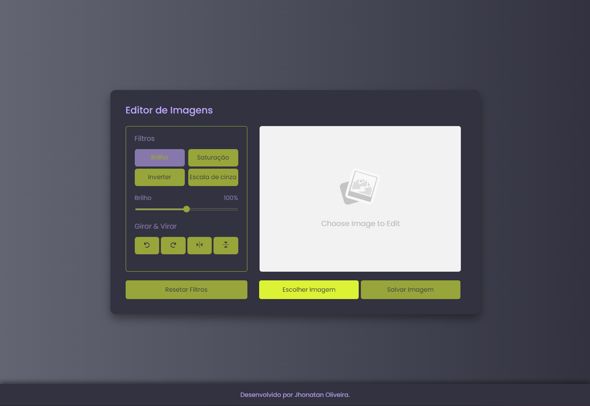
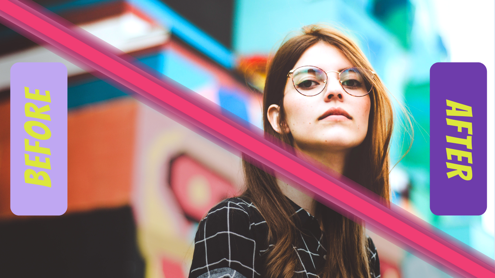

<h1 align="center">Photo Editor | Editor de fotos feito com JavaScript.</h1>

  <a href="#-tecnologias">Tecnologias</a>&nbsp;&nbsp;&nbsp;|&nbsp;&nbsp;&nbsp;
  <a href="#-projeto">Projeto</a>&nbsp;&nbsp;&nbsp;|&nbsp;&nbsp;&nbsp;
  <a href="#memo-licença">Licença</a>

 
  
  

    

    
  uma demonstração do que é possível fazer com este projeto.

 

  

# 📄 Descrição:

### O que foi desenvolvido?

- Um editor de fotos simples utilizando HTML, CSS e JavaScript puro. O editor possui recursos para alterar o brilho, saturação, escala de cinza e inverter, além de rotacionar e "flipar" a imagem. Após a edição, é possível salvar a imagem com as alterações realizadas.

# 🚀 Tecnologias:

Esse projeto foi desenvolvido com as seguintes tecnologias:

### HTML5

### CSS3

### JavaScript

# 🚧 Projeto:

### [Confira aqui!](https://photo-editor-puce.vercel.app/)

# 🎨 Inspiração:

###

# 📝 Licença:

Esse projeto está sob a licença MIT. Veja o arquivo LICENSE para mais detalhes.

Made by <a href="https://wwwjhonatan.oliveira.com/" target="_blank">Jhonatan Oliveira</a>.
